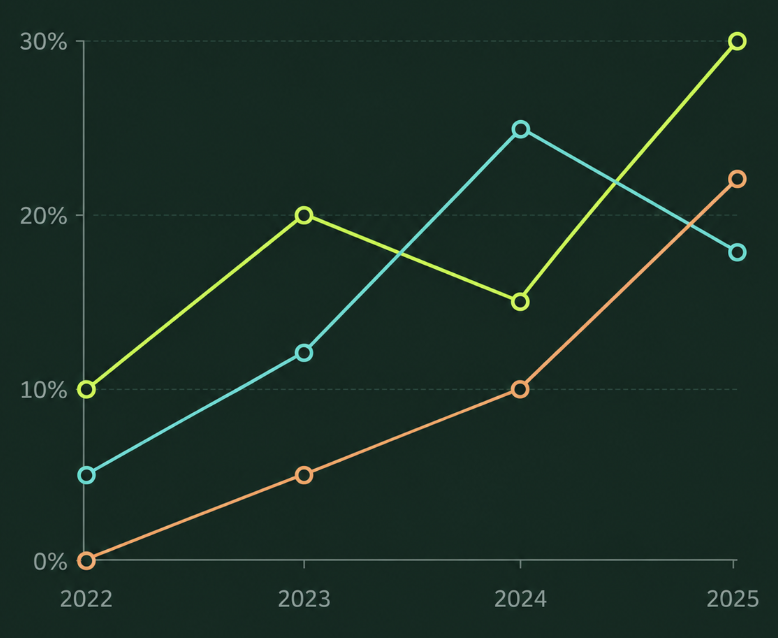

# 软件工程实践第二次作业——与 AI 结对完成顶会热词统计平台

> 本文工程内容已按最终本地版本更新。标记为 **【待截图】** 的位置需要在发布到 CSDN 前插入对应图片；云端部署暂缓，不虚构公网地址和公网测试结果。

## 作业信息

| 项目 | 内容 |
| --- | --- |
| 课程 | 软件工程实践 |
| 作业 | 第二次作业——与 AI 结对编程 |
| 作业要求 | [软件工程实践第二次作业要求](https://bbs.csdn.net/topics/620526318) |
| 学号 | 102400328 |
| 项目名称 | 视界脉冲（Vision Pulse）——计算机视觉顶会热词统计平台 |
| CodeArts 仓库 | [102400328 项目仓库浏览器页面](https://devcloud.cn-north-4.huaweicloud.com/codehub/project/cc8f24d1c344473688f742c7a429d0b7/codehub/3087813/repo) |
| 代码规范 | [codestyle.md](../codestyle.md) |
| Figma 设计稿 | [软件工程实践原型设计](https://www.figma.com/design/Oq2iDo2gYAb48uy7FDrsxX/%E8%BD%AF%E4%BB%B6%E5%B7%A5%E7%A8%8B%E5%AE%9E%E8%B7%B5?node-id=0-1&t=Ks4WTe5RqD47CL35-1) |
| Figma 交互原型 | [可交互原型](https://www.figma.com/proto/Oq2iDo2gYAb48uy7FDrsxX/%E8%BD%AF%E4%BB%B6%E5%B7%A5%E7%A8%8B%E5%AE%9E%E8%B7%B5?node-id=20-2&p=f&t=WLYGV7D1MSgvEdQj-1&scaling=scale-down&content-scaling=fixed&page-id=0%3A1&starting-point-node-id=20%3A2&show-proto-sidebar=1) |
| 云端部署 | 暂缓；已完成 Docker 配置与本地生产模式验证 |
| AI 工具 | OpenAI Codex 桌面端（基于 GPT-5） |

## 目录

- [一、项目概述](#一项目概述)
- [二、PSP 计划与实际耗时](#二psp-计划与实际耗时)
- [三、NABCD 需求分析](#三nabcd-需求分析)
- [四、原型设计](#四原型设计)
- [五、系统架构与实现思路](#五系统架构与实现思路)
- [六、功能实现与运行展示](#六功能实现与运行展示)
- [七、关键代码说明](#七关键代码说明)
- [八、测试与问题修复](#八测试与问题修复)
- [九、AI 协作过程](#九ai-协作过程)
- [十、项目管理与部署](#十项目管理与部署)
- [十一、总结与反思](#十一总结与反思)
- [十二、提交前检查表](#十二提交前检查表)

---

## 一、项目概述

### 1.1 项目背景

CVPR、ICCV 和 ECCV 是计算机视觉领域具有代表性的国际会议。论文数量多、研究方向变化快，仅靠人工阅读很难直观了解不同年份、不同会议的热点迁移。因此，我实现了“视界脉冲（Vision Pulse）”顶会热词统计平台，对论文数据进行管理、检索和关键词统计，并通过动态图表展示研究热点随时间的变化。

本项目不是简单的静态展示页，而是一个包含前后端、数据库、外部数据源和可视化分析的完整 Web 应用。平台支持：

1. 查看 CVPR、ICCV、ECCV 论文数据与热门关键词；
2. 按会议、年份和关键词筛选论文；
3. 查看年度热词排名动画和跨会议热度折线图；
4. 按题目优先检索本地数据库，本地未命中时查询外部论文源；
5. 通过 CSV 批量导入论文，并返回逐行校验结果；
6. 查看论文摘要、作者、关键词、原文链接和相关论文；
7. 新增、修改和删除本地论文数据。

### 1.2 技术栈

| 层次 | 使用技术 |
| --- | --- |
| 前端 | Vue 3、TypeScript、Vite、Vue Router、Pinia、Element Plus、ECharts |
| 后端 | Node.js、Express、TypeScript |
| 数据库 | SQLite |
| 测试 | Vitest、Supertest |
| 包管理 | pnpm workspace |
| 原型工具 | Figma |
| 代码托管 | 华为云 CodeArts Repo |

### 1.3 数据来源与统计口径

课程演示数据来自 CVF 官方开放论文库和 ECVA 官方论文列表。项目内保存了一份可离线复现的论文快照，采集范围为：

- CVPR 2023、2024；
- ICCV 2023、2025；
- ECCV 2022、2024；
- 每组均匀抽取 10 篇带摘要论文，共 60 篇。

这份数据用于展示系统能力，不代表各会议的完整录用论文集合，因此不能把图表结论直接外推为整个会议的真实总体趋势。

单篇外部检索使用 OpenAlex 获取论文元数据，DBLP 在可用时进行书目信息校对。外部论文不会自动写入本地数据库，必须由用户确认后保存，避免错误数据污染统计结果。

热度的计算公式为：

```text
关键词热度 = 当前筛选范围内包含该关键词的论文数 ÷ 当前筛选范围论文总数
```

同一篇论文中的同一关键词只统计一次。

---

## 二、PSP 计划与实际耗时

| PSP2.1 阶段 | 预估耗时（分钟） | 实际耗时（分钟） | 偏差原因 |
| --- | ---: | ---: | --- |
| Planning：明确作业要求与开发计划 | 40 | 50 | 除功能开发外，还需要同步规划原型、博客、部署和工程规范 |
| Estimate：任务拆分与工作量估算 | 20 | 30 | 初始拆分没有完全覆盖真实数据适配和多轮视觉调整 |
| Analysis：需求分析与 NABCD | 50 | 70 | 为保证分析与最终功能一致，补充了竞品和统计口径讨论 |
| Design Spec：系统与接口设计 | 60 | 80 | 进一步明确本地优先检索、外部候选确认和 CSV 部分成功策略 |
| Design Review：设计复核 | 40 | 70 | 多次对照 Figma 检查页面比例、弹窗和图表配色 |
| Coding Standard：制定代码规范 | 30 | 35 | 增加 TypeScript、Vue、Express、数据库和提交规范 |
| Design：Figma 页面和交互原型 | 150 | 230 | 页面与状态较多，导航、详情、导入结果和删除弹窗经历多轮调整 |
| Coding：前后端功能实现 | 340 | 360 | 外部 API、关键词派生、CSV 导入和响应式布局增加了实现工作量 |
| Code Review：代码检查与重构 | 60 | 65 | 按功能拆分检查改动，并修正长文本和错误处理问题 |
| Test：单元测试与接口测试 | 90 | 110 | 补充外部服务失败、CSV 非法数据和关键词派生等边界测试 |
| Reporting：博客与文档整理 | 80 | 100 | 需要整理 PSP、NABCD、关键代码、AI 协作记录和验收结果 |
| 合计 | **960** | **1200** | 实际比预估增加 **240 分钟，偏差率为 25%** |

### 2.1 偏差分析

本次开发中，原型和后端基础接口推进较顺利，但以下工作量明显高于最初预期：

1. **设计还原不是简单照搬。** Figma 使用固定画布，而浏览器需要适配不同宽度。论文详情中的长英文标题、长作者列表和长 URL 都会暴露固定宽度设计的问题，需要增加自动换行、截断和响应式布局。
2. **外部数据源不稳定。** OpenAlex 或 DBLP 可能超时、拒绝连接或临时不可用，因此必须设置超时、重试边界和对用户友好的错误提示。
3. **真实数据比演示数据复杂。** 官方论文可能没有关键词，摘要很长，作者数量也不固定，需要后端补充关键词提取规则，并在前端处理溢出和空状态。
4. **CSV 导入不仅是读取文件。** 系统还需要检查大小、行数、必填列、年份、URL 和重复数据，并允许成功记录保存、失败记录单独反馈。

从表格看，最大单项偏差出现在 Figma 页面和交互原型，实际比预计多 80 分钟。原因是固定画布中的示例文本较短，而前端接入真实论文后出现了长标题、长作者列表、长 URL、关键词为空等情况，需要回到设计和代码中反复调整。测试阶段比预计多 20 分钟，主要用于覆盖外部数据源失败和 CSV 非法输入等非正常路径。

最终总耗时为 1200 分钟，即 20 小时；相比预计的 960 分钟增加 240 分钟，整体偏差率为 25%。这说明我对核心编码工作量的判断相对接近，但低估了原型细化、真实数据边界和报告整理所需时间。今后估算同类全栈任务时，应单独为真实数据验收、视觉回归和文档整理预留缓冲，而不能全部包含在“编码”时间内。

---

## 三、NABCD 需求分析

### 3.1 N（Need，需求）

计算机视觉研究者和学生常常需要回答这些问题：近几年哪些方向更热门？同一关键词在 CVPR、ICCV、ECCV 中的热度是否一致？某个方向从哪一年开始增长？传统论文网站擅长单篇检索，但不擅长呈现跨年份、跨会议的趋势。

用户需要一个轻量、直观、可追溯的平台，把论文管理、关键词统计和趋势可视化放在同一个系统中。

### 3.2 A（Approach，做法）

本项目采用“本地数据优先、外部数据补充、统计结果可解释”的方案：

1. 将论文、作者和关键词等结构化数据存入 SQLite；
2. 优先使用论文自带关键词，没有关键词时从英文标题和摘要中提取；
3. 使用统一的大小写归一化、别名转换和停用词过滤规则；
4. 用柱状动画展示单个会议的年度 Top 关键词；
5. 用折线图对比同一关键词在三个会议中的热度；
6. 本地未检索到论文时，再访问 OpenAlex，并使用 DBLP 辅助校对；
7. 通过 CSV 导入支持用户扩充数据集，并返回精确到行的失败原因。

### 3.3 B（Benefit，好处）

- 比逐篇阅读论文更快地了解研究方向变化；
- 比单一排行榜更容易发现跨年份的上升或下降趋势；
- 数据来源、样本范围和统计公式清晰，避免“只有图、没有口径”；
- 支持数据维护和导入，后续可替换为更完整的数据集；
- 本地快照无需依赖网络，课堂展示时更稳定。

### 3.4 C（Competitors，竞争方案）

| 方案 | 优点 | 局限 | 本项目的差异 |
| --- | --- | --- | --- |
| Google Scholar | 文献范围广、引用信息丰富 | 不直接提供课程所需的跨会议热词动画 | 聚焦 CV 顶会和趋势可视化 |
| DBLP | 书目信息规范、会议分类清晰 | 摘要和关键词不完整，统计展示较弱 | DBLP 作为校对源，本地完成统计 |
| Papers with Code | 任务、榜单和代码关联丰富 | 关注任务和 SOTA，不适合自定义论文管理 | 支持本地论文 CRUD 与 CSV 导入 |
| Connected Papers 等关系图工具 | 论文关系直观 | 重点是引用/相似关系，不是会议年度热度 | 以关键词热度和会议对比为核心 |
| 手工使用 Excel | 易上手 | 数据清洗、重复统计和交互展示成本高 | 自动校验、计算和可视化 |

### 3.5 D（Delivery，推广与交付）

项目通过华为云 CodeArts 管理代码，并准备了 Docker 生产部署方案。由于当前暂缓购买云服务器，博客先提供仓库地址、原型链接、本地运行截图和使用说明；完成云端部署后再补充在线体验地址。演示时重点展示“热词动画—跨会议比较—论文详情—CSV 导入”的完整流程。

---

## 四、原型设计

### 4.1 设计定位

界面采用深绿色背景、荧光黄绿色主色和青色辅助色，形成偏技术、数据监测风格的视觉语言。全站导航、按钮、卡片圆角、边框和文本层级保持一致。

Figma 中共设计六类主要页面：

1. 热门总览；
2. 热度趋势；
3. 论文库；
4. 论文爬取与 CSV 导入；
5. 论文详情；
6. 关于平台。

此外还设计了论文新增/编辑、删除确认和 CSV 导入结果等状态。

### 4.2 原型链接

- [Figma 设计稿](https://www.figma.com/design/Oq2iDo2gYAb48uy7FDrsxX/%E8%BD%AF%E4%BB%B6%E5%B7%A5%E7%A8%8B%E5%AE%9E%E8%B7%B5?node-id=0-1&t=Ks4WTe5RqD47CL35-1)
- [Figma 交互原型](https://www.figma.com/proto/Oq2iDo2gYAb48uy7FDrsxX/%E8%BD%AF%E4%BB%B6%E5%B7%A5%E7%A8%8B%E5%AE%9E%E8%B7%B5?node-id=20-2&p=f&t=WLYGV7D1MSgvEdQj-1&scaling=scale-down&content-scaling=fixed&page-id=0%3A1&starting-point-node-id=20%3A2&show-proto-sidebar=1)

### 4.3 页面与交互逻辑

```text
热门总览
  ├─ 点击关键词 → 查看相关统计/论文
  ├─ 点击“查看论文” → 论文库
  └─ 导航到热度趋势

热度趋势
  ├─ 选择会议、年份和关键词
  ├─ 播放/暂停年度排名动画
  └─ 查看同一关键词的跨会议折线对比

论文库
  ├─ 组合条件查询
  ├─ 新增/编辑/删除论文
  └─ 点击标题 → 论文详情

数据导入
  ├─ 按题目查询本地论文
  ├─ 未命中时查询外部来源
  ├─ 用户确认后保存候选论文
  └─ 上传 CSV → 显示成功数与逐行失败原因
```

### 4.4 原型截图

> 最终至少放入 10 张清晰截图或 GIF。每张图需要有编号和说明，不能只堆图片。

1. 【待截图 1：热门总览原型】
2. 【待截图 2：热度趋势原型】
3. 【待截图 3：论文列表原型】
4. 【待截图 4：新增或编辑论文弹窗】
5. 【待截图 5：删除确认弹窗】
6. 【待截图 6：论文检索和 CSV 上传原型】
7. 【待截图 7：CSV 导入结果】
8. 【待截图 8：论文详情】
9. 【待截图 9：关于平台】
10. 【待截图 10：Figma 原型连线或交互演示】

---

## 五、系统架构与实现思路

### 5.1 总体架构

```text
┌─────────────────────────────────────────────┐
│                  浏览器                      │
│ Vue 3 + TypeScript + Element Plus + ECharts │
└──────────────────────┬──────────────────────┘
                       │ REST API
┌──────────────────────▼──────────────────────┐
│              Express 应用服务               │
│ 论文管理 / 检索 / CSV 导入 / 关键词统计     │
└───────────────┬──────────────────┬──────────┘
                │                  │
┌───────────────▼──────────┐  ┌────▼──────────────┐
│       SQLite 数据库       │  │ 外部论文数据源     │
│ papers / authors / tags  │  │ OpenAlex / DBLP   │
└──────────────────────────┘  └───────────────────┘
```

### 5.2 前端结构

前端通过 Vue Router 划分六个页面，公共导航栏、页面标题、论文表单、关键词图谱和趋势折线图被拆分为独立组件。API 请求统一经过 `web/src/api/client.ts`，避免每个页面重复处理响应格式和错误信息。

```text
web/src/
├─ api/client.ts
├─ components/
│  ├─ AppHeader.vue
│  ├─ PageIntro.vue
│  ├─ KeywordGraphChart.vue
│  ├─ TrendLineChart.vue
│  └─ PaperFormDialog.vue
├─ router/index.ts
└─ views/
   ├─ OverviewView.vue
   ├─ TrendsView.vue
   ├─ PapersView.vue
   ├─ ImportView.vue
   ├─ PaperDetailView.vue
   └─ AboutView.vue
```

### 5.3 后端结构

后端按业务模块组织，而不是把所有接口写在一个文件中：

```text
server/src/
├─ integrations/       # OpenAlex、DBLP 和通用 HTTP 请求
├─ database/           # SQLite 初始化与连接
├─ modules/
│  ├─ paper/           # 论文 CRUD
│  ├─ search/          # 本地优先检索
│  ├─ import/          # CSV 解析与导入
│  ├─ analysis/        # Top 10、共现图谱、年度趋势
│  └─ seed/            # 官方论文样本初始化
└─ app.ts              # 路由装配与错误处理
```

### 5.4 本地优先检索策略

```text
输入论文题目
    ↓
查询本地 SQLite
    ├─ 命中 → 直接返回本地论文
    └─ 未命中
          ↓
      查询 OpenAlex
          ↓
      DBLP 可用时辅助校对
          ↓
      返回候选项（不自动入库）
          ↓
      用户确认后保存
```

这种方式兼顾了响应速度、课堂演示稳定性和外部数据扩展能力。

---

## 六、功能实现与运行展示

在实现过程中，我把“页面存在”与“功能完成”区分开来。每项功能都需要有真实数据流和可验证的结果，而不是只还原静态原型。

| 功能 | 输入 | 系统行为 | 可验证输出 |
| --- | --- | --- | --- |
| 热门总览 | 会议、年份范围 | 查询统计接口并计算关键词热度与共现关系 | 论文总数、Top 10、关系图 |
| 年度趋势 | 会议、关键词 | 按会议和年份分组并生成动画帧 | 年度排名柱状动画、跨会议折线 |
| 论文查询 | 题目、关键词、会议、年份、编号 | 组合过滤、分页和精确题目匹配 | 论文列表与总页数 |
| 论文维护 | 论文表单 | 校验后新增或更新，删除前二次确认 | 数据库记录和操作反馈 |
| 外部检索 | 完整论文题目 | 本地优先，未命中才查询 OpenAlex/DBLP | 本地结果或待确认候选项 |
| CSV 导入 | UTF-8 CSV 文件 | 文件级检查、逐行校验、部分成功保存 | 成功数、失败数和失败明细 |
| 论文详情 | 论文编号 | 并行请求论文详情和相关推荐 | 摘要、关键词、原文、相关论文 |

### 6.1 热门总览

总览页展示样本规模、关键词 Top 10、关键词共现关系和会议/年份概况，帮助用户快速掌握当前数据范围。

【待截图：前端热门总览实际运行效果】

### 6.2 年度热词排名动画

趋势页将不同年份作为动画帧，每隔固定时间切换一次年度数据。用户可以暂停、继续、重新播放，也可以点击年份直接跳转。柱子高度按当前帧最大热度归一化，使排名变化更直观。

【待插入 GIF：年度热词排名变化动画】

### 6.3 跨会议折线对比

选择一个关键词后，系统同时显示该词在 CVPR、ICCV 和 ECCV 中的年度热度。与原型中的浅色图表相比，最终前端采用与全站一致的深色图表背景，提高视觉统一性和对比度。



### 6.4 论文检索与管理

论文库支持题目、关键词、会议、年份、论文编号等组合查询，并支持精确匹配。表格中的长标题使用省略显示，点击后进入详情页。删除操作需要二次确认，弹窗使用深色主题，避免浏览器默认白色弹窗破坏视觉统一。

【待截图：论文列表、筛选条件和分页】

【待截图：深色删除确认弹窗】

### 6.5 论文详情与相关推荐

详情页展示标题、会议、年份、来源、作者、摘要、关键词和原文链接。针对真实论文标题、作者和 URL 较长的问题，页面使用响应式列宽、自动换行和文本截断，避免内容撑宽浏览器。右侧根据共享关键词推荐相关论文。

【待截图：论文详情实际运行效果】

### 6.6 CSV 批量导入

前端在选择文件时先检查扩展名和 1 MB 大小限制；后端继续校验 CSV 结构和每行数据。导入结束后分别显示总数据、成功导入和导入失败数量。如果某些行失败，系统显示具体行号和原因，而成功行仍会保存。

必填列为：

```text
title, conference, year, paperUrl
```

`authors` 和 `keywords` 中的多个值使用 `|` 分隔。

【待截图：CSV 文件选择状态】

【待截图：带失败明细的 CSV 导入结果】

### 6.7 关于平台

关于页面说明平台定位、三个会议、数据范围、关键词提取规则和热度统计口径，防止用户误解样本数据。

【待截图：关于平台实际运行效果】

---

## 七、关键代码说明

> 作业要求展示约 300 行关键代码。最终版将从下列模块中选取完整且连续的核心代码，并补充行号截图或代码块。当前先展示代表性片段。

### 7.1 关键词规范化与自动提取

论文优先使用原始关键词；若没有关键词，系统会从标题和摘要中识别技术短语，再按词频和位置权重补充单词。标题中的词权重为 3，摘要中的词权重为 1。

```ts
export function normalizeKeyword(value: string): string | null {
  const normalized = clean(value);
  if (!normalized || /^\d+$/.test(normalized)) return null;

  const alias = phraseAliases.get(normalized) ?? normalized;
  if (alias.split(' ').every((word) => stopwords.has(word))) return null;
  return alias;
}

export function keywordsForPaper(
  paper: Pick<Paper, 'keywords' | 'title' | 'abstract'>,
): string[] {
  const explicit = [...new Set(
    paper.keywords
      .map(normalizeKeyword)
      .filter((keyword): keyword is string => keyword !== null),
  )];
  if (explicit.length > 0) return explicit;

  const title = clean(paper.title);
  const abstract = clean(paper.abstract ?? '');
  const combined = `${title} ${abstract}`;
  const phrases = technicalPhrases.filter((phrase) =>
    containsPhrase(combined, phrase),
  );
  const coveredWords = new Set(phrases.flatMap((phrase) => phrase.split(' ')));
  const scores = new Map<string, number>();

  for (const [text, weight] of [[title, 3], [abstract, 1]] as const) {
    for (const word of text.split(' ')) {
      if (
        word.length < 4
        || /^\d+$/.test(word)
        || stopwords.has(word)
        || coveredWords.has(word)
      ) continue;
      scores.set(word, (scores.get(word) ?? 0) + weight);
    }
  }

  const singleWords = [...scores]
    .sort(([leftWord, leftScore], [rightWord, rightScore]) =>
      rightScore - leftScore || leftWord.localeCompare(rightWord))
    .slice(0, Math.max(0, 8 - phrases.length))
    .map(([word]) => word);

  return [...new Set([...phrases, ...singleWords])].slice(0, 8);
}
```

### 7.2 CSV 导入的前端交互

前端负责扩展名、文件大小和空文件选择等即时反馈，并以 `text/csv` 请求体把原始内容发送给后端。真正决定数据能否写入的校验仍在服务端执行，避免用户绕过浏览器检查直接调用接口。核心的逐行校验代码统一放在 7.7 节展示。

### 7.3 趋势动画状态控制

```ts
const frames = computed(() =>
  data.value?.frames.filter((item) => item.conference === conference.value) ?? [],
);
const frame = computed(() => frames.value[frameIndex.value]);

function resetTimer(): void {
  window.clearInterval(timer);
  if (!playing.value || frames.value.length < 2) return;

  timer = window.setInterval(() => {
    frameIndex.value = (frameIndex.value + 1) % frames.value.length;
  }, 1800);
}

function replay(): void {
  frameIndex.value = 0;
  playing.value = true;
  resetTimer();
}

watch([playing, frames], () => {
  frameIndex.value = Math.min(
    frameIndex.value,
    Math.max(0, frames.value.length - 1),
  );
  resetTimer();
});

onBeforeUnmount(() => window.clearInterval(timer));
```

### 7.4 Express 路由装配与统一错误处理

Express 入口只负责装配论文、检索、导入和统计路由，并在最后注册统一错误处理中间件。路由依赖通过构造参数传入，因此接口测试可以使用临时数据库和模拟外部服务，不需要连接真实网络。该部分属于框架装配代码，完整实现可在仓库的 `server/src/app.ts` 查看，博客不再大段复制。

### 7.5 本地优先检索

本地检索和外部检索之间没有混杂在路由层，而是由 `PaperSearchService` 明确控制顺序。只要本地精确标题查询命中，就不会发起外部网络请求；本地未命中时才调用外部搜索服务。这既缩短了常见查询的响应时间，也让系统在断网时仍能使用已有论文。

```ts
import type { ExternalPaperSearchResult } from '@hotwords/shared';
import { PaperRepository } from '../paper/paper.repository.js';
import type { Paper } from '../paper/paper.types.js';
import { ExternalPaperSearchService } from './external-paper-search.service.js';

export type PaperSearchResult =
  | { origin: 'local'; items: Paper[]; warnings: string[] }
  | ({ origin: 'external' } & ExternalPaperSearchResult);

export class PaperSearchService {
  constructor(
    private readonly paperRepository: PaperRepository,
    private readonly externalSearch: ExternalPaperSearchService,
  ) {}

  async searchByTitle(title: string): Promise<PaperSearchResult> {
    const local = this.paperRepository.list({
      exactTitle: title,
      page: 1,
      pageSize: 100,
    });

    if (local.items.length > 0) {
      return {
        origin: 'local',
        items: local.items,
        warnings: [],
      };
    }

    return {
      origin: 'external',
      ...await this.externalSearch.searchByTitle(title),
    };
  }
}
```

### 7.6 外部请求的失败分类与有限重试

外部论文服务可能出现网络中断、限流、网关错误和无效 JSON。`fetchJson` 只对 `429`、`502`、`503`、`504` 等临时状态以及网络异常进行有限重试，不会对所有错误无限重试。最终错误会被转换为带数据源名称和状态码的 `ExternalProviderError`，便于上层生成准确提示。

```ts
import { ExternalProviderError } from '../external-provider.error.js';

export type FetchLike = typeof fetch;

export interface FetchJsonOptions {
  retries?: number;
  retryDelayMs?: number;
}

function isTransientStatus(status: number): boolean {
  return status === 429
    || status === 502
    || status === 503
    || status === 504;
}

async function delay(milliseconds: number): Promise<void> {
  if (milliseconds <= 0) return;
  await new Promise((resolve) => setTimeout(resolve, milliseconds));
}

export async function fetchJson(
  provider: string,
  url: URL,
  init: RequestInit,
  fetchImplementation: FetchLike,
  options: FetchJsonOptions = {},
): Promise<unknown> {
  const retries = options.retries ?? 1;
  const retryDelayMs = options.retryDelayMs ?? 750;
  let response: Response | undefined;

  for (let attempt = 0; attempt <= retries; attempt += 1) {
    try {
      response = await fetchImplementation(url, init);
    } catch (error) {
      if (attempt < retries) {
        await delay(retryDelayMs);
        continue;
      }
      throw new ExternalProviderError(
        provider,
        `${provider} 请求失败`,
        null,
        { cause: error },
      );
    }

    if (
      response.ok
      || !isTransientStatus(response.status)
      || attempt === retries
    ) break;

    await delay(retryDelayMs);
  }

  if (!response?.ok) {
    throw new ExternalProviderError(
      provider,
      `${provider} 返回了 HTTP ${response?.status ?? '未知状态'}`,
      response?.status ?? null,
    );
  }

  try {
    return await response.json();
  } catch (error) {
    throw new ExternalProviderError(
      provider,
      `${provider} 返回了无效 JSON`,
      response.status,
      { cause: error },
    );
  }
}
```

### 7.7 CSV 逐行校验与部分成功策略

CSV 服务先检查文件级错误，再处理每一行。文件过大、表头缺失或包含不支持的列时直接拒绝；某一数据行存在问题时只记录该行失败，其他合法行仍可保存。最终导入任务会保存成功数量、失败数量和 JSON 格式的错误报告。

```ts
const requiredColumns = [
  'title',
  'conference',
  'year',
  'paperUrl',
] as const;

const allowedColumns = new Set([
  'externalId',
  'title',
  'abstract',
  'keywords',
  'authors',
  'conference',
  'venue',
  'year',
  'paperUrl',
  'doi',
]);

function optional(value: string | undefined): string | undefined {
  const trimmed = value?.trim();
  return trimmed || undefined;
}

function splitList(value: string | undefined): string[] {
  return value
    ?.split('|')
    .map((item) => item.trim())
    .filter(Boolean) ?? [];
}

export class CsvImportService {
  constructor(
    private readonly database: DatabaseSync,
    private readonly papers: PaperService,
  ) {}

  importText(fileName: string, csv: string): ImportResult {
    if (Buffer.byteLength(csv, 'utf8') > 1_000_000) {
      throw new CsvImportError('CSV 文件不能超过 1 MB');
    }

    let rows;
    try {
      rows = parseCsv(csv);
    } catch (error) {
      if (error instanceof CsvFormatError) {
        throw new CsvImportError(error.message);
      }
      throw error;
    }

    if (rows.length < 2) {
      throw new CsvImportError('CSV 文件没有可导入的数据行');
    }
    if (rows.length > 501) {
      throw new CsvImportError('单次最多导入 500 篇论文');
    }

    const headers = rows[0]?.cells.map((cell) => cell.trim()) ?? [];
    if (
      new Set(headers).size !== headers.length
      || headers.some((header) => !allowedColumns.has(header))
    ) {
      throw new CsvImportError('CSV 表头包含重复或不支持的列');
    }

    const missing = requiredColumns.filter(
      (column) => !headers.includes(column),
    );
    if (missing.length > 0) {
      throw new CsvImportError(`CSV 缺少必填列：${missing.join('、')}`);
    }

    const insertTask = this.database.prepare(`
      INSERT INTO import_tasks (file_name, status, total_count)
      VALUES (?, 'running', ?)
    `).run(fileName, rows.length - 1);

    const id = Number(insertTask.lastInsertRowid);
    const failures: ImportFailure[] = [];
    let successCount = 0;

    for (const row of rows.slice(1)) {
      const raw = Object.fromEntries(
        headers.map((header, index) => [
          header,
          optional(row.cells[index]),
        ]),
      );

      try {
        if (row.cells.length !== headers.length) {
          throw new CsvImportError('列数与表头不一致');
        }
        if (!raw.conference) {
          throw new CsvImportError('conference 不能为空');
        }
        if (!raw.year || !/^\d{4}$/.test(raw.year)) {
          throw new CsvImportError('year 必须是四位年份');
        }

        this.papers.create({
          ...raw,
          keywords: splitList(raw.keywords),
          authors: splitList(raw.authors),
          year: Number(raw.year),
          source: 'csv',
        });
        successCount += 1;
      } catch (error) {
        failures.push({
          line: row.line,
          title: raw.title ?? null,
          reason: error instanceof Error ? error.message : '未知错误',
        });
      }
    }

    this.database.prepare(`
      UPDATE import_tasks
      SET status = 'completed', success_count = ?,
          failure_count = ?, error_report = ?,
          updated_at = CURRENT_TIMESTAMP
      WHERE id = ?
    `).run(
      successCount,
      failures.length,
      JSON.stringify(failures),
      id,
    );

    return {
      id,
      fileName,
      status: 'completed',
      totalCount: rows.length - 1,
      successCount,
      failureCount: failures.length,
      failures,
    };
  }
}
```

### 7.8 热度、共现关系与年度趋势

分析服务始终先取得当前筛选范围内的论文，再以相同的关键词规则统计。`topKeywords` 计算论文数和热度；`graph` 对同一篇论文中的关键词两两组合，形成共现边；`trends` 按会议和年份分组，分别产生折线点和动画帧。

```ts
function compareStats(left: KeywordStat, right: KeywordStat): number {
  return right.paperCount - left.paperCount
    || left.keyword.localeCompare(right.keyword);
}

function countKeywords(papers: AnalysisPaper[]): Map<string, number> {
  const counts = new Map<string, number>();
  for (const paper of papers) {
    for (const keyword of keywordsForPaper(paper)) {
      counts.set(keyword, (counts.get(keyword) ?? 0) + 1);
    }
  }
  return counts;
}

function stat(
  keyword: string,
  paperCount: number,
  totalPapers: number,
): KeywordStat {
  return {
    keyword,
    paperCount,
    heat: totalPapers === 0 ? 0 : paperCount / totalPapers,
  };
}

topKeywords(filters: AnalysisFilters = {}, limit = 10): {
  totalPapers: number;
  items: KeywordStat[];
} {
  const papers = this.papers(filters);
  const items = [...countKeywords(papers)]
    .map(([keyword, count]) => stat(keyword, count, papers.length))
    .sort(compareStats)
    .slice(0, limit);

  return { totalPapers: papers.length, items };
}
```

共现图的完整实现使用同一份 `countKeywords` 结果筛选节点，再把每篇论文中的已选关键词两两组合并累计边权；年度趋势则按 `会议:年份` 分组，生成排序后的动画帧和折线点。两者都复用同一套规范化规则，避免三个图表统计口径不一致。

### 7.9 代码展示范围总结

上述代码覆盖了关键词提取、趋势动画、路由装配、本地优先检索、外部服务可靠性、CSV 导入和统计分析等核心流程。博客中的代码不是为了凑行数复制整个项目，而是选择了能够连接“数据进入系统—清洗—统计—展示—异常处理”的关键部分。每一段都说明了设计目的和边界条件，便于读者结合仓库查看完整实现。

---

## 八、测试与问题修复

### 8.1 测试策略

项目使用 Vitest 编写单元测试和接口测试，Supertest 用于验证 Express API。测试重点包括：

- SQLite 初始化和迁移；
- 论文仓储及 CRUD；
- 本地优先检索；
- OpenAlex 和 DBLP 客户端响应映射；
- 外部服务超时和异常；
- CSV 表头、字段和逐行校验；
- 关键词规范化、Top 10、图谱和趋势统计；
- 统一 API 响应和错误状态码。

最终验收命令：

```powershell
pnpm test
pnpm typecheck
pnpm build
```

2026 年 9 月 22 日在项目根目录执行最终检查，结果如下：

| 检查项 | 实际结果 | 结论 |
| --- | --- | --- |
| `pnpm test` | 服务端 16 个测试文件、44 个测试全部通过；共享包和前端目前没有测试文件 | 通过，但前端自动化覆盖仍可补充 |
| `pnpm typecheck` | shared、server、web 均通过严格类型检查 | 通过 |
| `pnpm build` | shared、server、web 均成功构建 | 通过 |
| 人工前端验收 | 35 项检查中 33 项通过；2 项因当前网络无法访问 OpenAlex/DBLP 而显示预期的友好错误提示 | 本地功能通过，外部源需在不同网络环境复验 |
| 生产模式冒烟测试 | `/api/health`、首页、详情路由刷新均正常，未知 API 返回 JSON 404 | 通过 |

Vite 构建时提示部分产物压缩后超过 500 kB。它不会导致构建失败，也不影响当前课程项目运行，但说明 Element Plus、ECharts 等依赖形成的公共包仍可进一步拆分。后续可通过手动分包或按需加载降低首屏资源体积。本文不把该警告描述成“完全没有问题”，而是将其作为性能改进项保留。

当前自动化测试主要集中在后端业务规则和 API。前端已经通过类型检查、生产构建和 35 项人工验收，覆盖导航、筛选、表单、删除确认、CSV 导入、趋势图表与移动端布局。前端尚未配置组件测试或端到端测试，这是后续仍可完善的工程项。

### 8.2 CSV 验收数据设计

为了同时验证成功路径和失败路径，可以准备下列 CSV：

```csv
title,conference,year,paperUrl,authors,keywords
Valid Paper,CVPR,2024,https://example.com/valid,Author A|Author B,Object Detection|Open World
Invalid Year Paper,ICCV,20X5,https://example.com/year,Author C,Vision Language
Invalid URL Paper,ECCV,2024,not-a-url,Author D,Segmentation
```

预期结果为总数据 3 条，第 1 条成功保存，后两条分别返回年份和 URL 校验错误。还需要分别测试：空文件、缺少必填列、重复表头、超过 500 条和超过 1 MB。这样可以证明页面上的“成功数/失败数”不是静态原型数据，而是后端真实校验结果。

### 8.3 问题一：外部论文数据源不可用

**现象：** 在论文检索页输入真实论文题目后，页面提示“外部论文数据源暂时不可用”。

**定位过程：** 本地数据库没有命中后，请求会进入 OpenAlex/DBLP。外部请求可能受到网络、超时、限流或上游临时故障影响。最初错误粒度不足，难以判断到底是没有结果还是上游失败。

**修改：**

1. 将通用网络请求封装在独立模块中；
2. 增加请求超时和可识别的外部数据源异常；
3. 将“无搜索结果”和“外部数据源不可用”区分处理；
4. 补充异常分支测试，防止外部错误变成未处理的 500；
5. 保持本地优先，使外部网络不可用时仍能使用已有数据。

### 8.4 问题二：真实论文详情撑宽浏览器

**现象：** 英文论文标题、作者列表和原文链接较长，详情页总宽度超过浏览器可视范围，右侧相关论文卡片也被压缩得过窄。

**原因：** 原型以固定画布和短示例文本设计，真实数据暴露出 Grid 子项的最小内容宽度、URL 不换行和长标题不截断等问题。

**修改：** 为内容列设置可收缩宽度，长文本使用 `overflow-wrap`，URL 区域使用截断显示，相关论文标题限制行数，并为较窄屏幕设置单列布局。

### 8.5 问题三：真实论文缺少关键词

**现象：** 从外部数据源保存的多篇论文在详情页显示“暂无关键词”，相关论文推荐也失去依据。

**原因：** 官方页面或外部接口并不保证提供关键词字段。

**修改：** 当论文没有显式关键词时，后端从标题和摘要中自动提取。提取过程包含大小写统一、别名转换、停用词过滤、技术短语优先以及标题加权。这样既能显示关键词，也能继续计算热度和相关推荐。

---

## 九、AI 协作过程

### 9.1 使用方式说明

本项目使用 OpenAI Codex 作为 AI 结对伙伴。AI 参与了作业要求梳理、架构讨论、测试设计、代码实现建议、Figma 尺寸与样式推导、问题定位和博客结构整理。

我没有直接接受所有 AI 输出，而是通过以下方式控制质量：

1. 先让 AI 读取作业要求和当前项目，再制定方案；
2. 将大任务拆成可以验证的小步骤；
3. 要求 AI 在修改后运行测试、类型检查和构建；
4. 对视觉结果逐页与 Figma 对比，由我指出差异并决定修改方向；
5. 前期由我逐次确认 Git 提交，收尾阶段在我明确授权后按已验证的独立工作单元提交；
6. 对外部数据和作业规则要求给出来源，不让 AI 凭印象补全。

本次结对中双方的职责划分如下：

| 环节 | AI 主要作用 | 我的主要作用 |
| --- | --- | --- |
| 需求理解 | 整理作业评分项、发现遗漏 | 确认范围和优先级 |
| 原型设计 | 提供尺寸、位置和交互建议 | 决定视觉风格并在 Figma 中实际绘制 |
| 架构设计 | 比较模块划分和数据流方案 | 选择本地优先、单体应用等最终方案 |
| 编码 | 生成局部实现、测试和修改建议 | 审查代码、运行项目、决定是否接受 |
| 调试 | 根据日志和截图提出原因假设 | 提供真实复现条件并验证修改结果 |
| Git | 汇总适合提交的独立改动并核对测试结果 | 前期逐次授权，收尾阶段确认整体规则与发布范围 |
| 博客 | 整理结构和可核实的工程事实 | 提供个人时间、截图、感受和最终表述 |

我把 AI 输出视为“需要验证的结对伙伴建议”，而不是天然正确的最终答案。功能修改至少要经过代码差异检查和相关测试；视觉修改则需要在真实浏览器尺寸和真实论文数据下复核。

> 最终版需要加入真实对话截图，并保留提示词、AI 输出概要、人工修改和修改原因。

### 9.2 代表案例一：从需求到原型

**目标：** 将作业要求转化为可以实现的页面结构和交互原型。

**我的提示词（节选）：**

```text
按照作业要求设计顶会热词统计平台，以我的设计为主，
需要热门总览、热度趋势、论文库、数据导入、论文详情和关于页面。
```

**AI 输出概要：** AI 建议使用统一导航和六页结构，并逐步给出卡片尺寸、文字层级、按钮位置、删除弹窗、CSV 导入结果和论文详情的布局建议。

**我的修改：**

- 保留我选定的深绿和荧光绿视觉风格；
- 删除不必要的“原型示意，最终数值以系统统计为准”；
- 将浅色折线图改为深色主题；
- 调整弹窗配色，避免白色弹窗与主页面不协调；
- 对导航栏使用组件化思路统一修改。

**修改原因：** AI 的初稿能快速补齐信息结构，但部分建议偏通用后台风格，与我的视觉方案不一致，需要由我确定最终审美和内容取舍。

【待截图：该案例的 AI 对话记录和 Figma 前后对比】

### 9.3 代表案例二：实现本地优先论文检索和 CSV 导入

**目标：** 既能检索本地论文，也能在未命中时查询外部数据，并支持批量导入。

**我的提示词（节选）：**

```text
实现按题目检索论文和 CSV 文件导入。
本地数据库优先，外部候选必须由用户确认后才能保存。
CSV 导入要显示总数、成功数、失败数和失败原因。
```

**AI 输出概要：** AI 将功能拆为本地检索服务、OpenAlex/DBLP 集成、CSV 解析服务、导入 API 和前端结果面板，并补充了输入限制和测试用例。

**我的修改：**

- 明确限制 CSV 最大 1 MB、最多 500 条；
- 指定必填字段和多值分隔符；
- 将导入设计为“部分成功”，而不是一行失败就全部回滚；
- 调整前端导入结果配色和布局，使其与 Figma 一致。

**修改原因：** 这些规则能使功能更符合真实使用场景，也便于用户定位错误数据。

【待截图：该案例的提示词、接口测试和导入结果】

### 9.4 代表案例三：调试外部数据源与长文本布局

**目标：** 修复外部检索不可用，以及真实论文详情宽度溢出的问题。

**我的提示词（节选）：**

```text
依旧显示外部信息源不可用。
论文详情为什么这么宽，浏览器都放不下？
尽量按照我的设计为主，适当做出合理优化。
```

**AI 输出概要：** AI 检查请求链路和页面样式，建议对外部请求增加明确异常类型和超时处理；对详情页增加可收缩列、自动换行、文本截断与响应式断点。

**我的修改：** 我提供真实运行截图定位问题，要求保留原设计的主要比例，同时允许为真实数据做响应式优化；修改后继续使用真实长标题、长作者列表进行验证。

**修改原因：** 单看示例数据无法发现边界问题，必须用真实数据验证。AI 适合快速定位技术原因，但是否接受布局变化需要由我根据设计目标判断。

【待截图：错误提示、修改前详情页、修改后详情页和测试结果】

### 9.5 对 AI 输出的总体评价

AI 在任务拆分、生成重复性代码、补充边界测试和解释技术问题方面效率很高，尤其适合根据明确约束快速迭代。但 AI 并不能自动理解我的全部视觉偏好，也可能在缺少真实运行环境时给出过于理想化的建议。因此，本次结对过程的关键不是“让 AI 一次生成完整项目”，而是由我持续提供约束、检查结果、拒绝不合适方案，并把每次修改控制在可验证范围内。

我认为 AI 最有价值的地方不是代替思考，而是缩短“提出方案—得到实现—运行验证—继续修正”的循环。相对地，当输入只有一句“下一步”时，AI 容易依据通用经验补全细节，结果可能偏离设计稿。后续我逐渐改用截图、具体文字、目标位置和验收条件描述问题，协作效率明显提高。

### 9.6 AI 协作记录的可追溯性

为了让博客中的 AI 协作记录可验证，最终整理时每个代表案例都采用相同结构：

1. 问题背景和当时的工程状态；
2. 我输入的原始提示词；
3. AI 输出的核心建议，而不是只截取结果；
4. 我接受、拒绝或修改了哪些内容；
5. 修改理由；
6. 最终代码、页面或测试结果；
7. 对下一次提示方式的改进。

这种记录方式比简单写“使用 AI 完成了某功能”更能体现结对过程，也能说明最终成果由我审查和负责。

---

## 十、项目管理与部署

### 10.1 代码规范

项目代码规范参考 Google TypeScript Style Guide 和 Vue 官方风格指南，并在仓库的 `codestyle.md` 中说明：

- TypeScript 开启严格模式；
- 使用 ESLint/格式化约定保持风格一致；
- Vue 组件名使用 PascalCase；
- 业务模块按职责拆分；
- API 使用统一成功/失败结构；
- 测试文件与被测模块相邻；
- Git 提交遵循 Conventional Commits。

### 10.2 Git 提交策略

开发分支为 `dev`。提交按文档、工程骨架、数据库、论文仓储、管理 API、检索、数据初始化与分析、可靠性修复、前端页面等阶段逐步进行，避免把所有代码集中在一次提交中。

在本次博客事实校正提交之前，共完成 24 次有效提交，完整记录如下：

```text
0b71dc5 Add README.md
33bf768 chore: add repository ignore rules
fb225ac docs: add approved design and implementation plan
8f7aca0 chore: scaffold TypeScript web and server workspaces
370f9c2 feat(server): add resilient external paper search
f66773d feat(server): add SQLite schema and migrations
7888164 feat(server): implement paper repository
d734fd6 feat(server): implement paper management API
b8a22d8 feat(server): add local-first paper search
06c0717 feat(server): add official seed data, CSV import and analysis APIs
c6cbd27 fix(server): harden external paper requests
5e363b7 fix(server): derive keywords for paper responses
ca91c08 docs: add project code style guide
511b825 docs: add project report draft
76e14a4 docs: complete PSP time analysis
c3aed53 docs: update report links and completion status
d79136b docs: link CodeArts repository page
579f99e docs: add trend chart prototype assets
aa7bd5b feat(web): implement complete conference insights frontend
37b322c docs: design Flexus production release
d11abc3 docs: plan Flexus production release
d3e5714 feat(server): serve production web build
71f8a29 chore(deploy): add Flexus Docker packaging
e64065d docs: finalize project README and deployment guide
```

【待截图：CodeArts 或本地 Git 的完整提交记录】

### 10.3 本地运行

环境要求：Node.js 24.15+、pnpm 11.5.1。

```powershell
pnpm install
pnpm db:seed
pnpm dev
```

后端默认运行在 `http://localhost:3000`，可以先访问 `/api/health` 检查服务状态。

### 10.4 华为云部署

开发环境由 Vite 在 `5173` 端口提供前端页面，并把 `/api` 代理到 `3000` 端口的 Express 服务。生产版本已经改为由同一个 Express 进程提供 `/api/*`、`web/dist` 静态资源和 Vue Router 回退页面，避免依赖 Vite 开发服务器：

```text
浏览器
   ↓ HTTP/HTTPS
华为云公网入口
   ├─ /、/assets/*  → Vue 生产构建产物
   └─ /api/*        → Express API
                         ↓
                     SQLite 数据库文件
```

仓库根目录提供了 `Dockerfile` 和 `.dockerignore`。镜像基于 Node.js 24，构建时安装锁定依赖并执行生产构建，启动时幂等初始化数据库。部署命令为：

```bash
docker build -t vision-pulse:1.0.0 .
sudo mkdir -p /opt/vision-pulse/data
docker run -d \
  --name vision-pulse \
  --restart unless-stopped \
  -p 80:3000 \
  -v /opt/vision-pulse/data:/data \
  vision-pulse:1.0.0
```

需要配置的运行参数包括：

| 配置 | 作用 | 注意事项 |
| --- | --- | --- |
| `PORT` | Express 监听端口，默认 3000 | 与反向代理目标保持一致 |
| `DATABASE_PATH` | SQLite 数据库文件位置 | 容器内固定为 `/data/hotwords.sqlite`，宿主机挂载持久化目录 |
| `WEB_DIST_PATH` | Vue 生产构建目录 | 镜像内固定为 `/app/web/dist`，由 Express 提供 |
| `/api` 路由优先级 | 保证未知 API 返回 JSON 404 | 必须注册在前端 SPA 回退之前 |

本机未安装 Docker，因此没有虚构镜像构建结果；但已经使用与容器一致的生产环境变量完成等价启动验证：健康接口、首页和详情路由均返回 200，未知 API 返回 JSON 404，44 项自动化测试、类型检查和生产构建全部通过。

华为云服务器部署按当前安排暂缓。恢复部署后还需要验证：六个页面直接访问与刷新、论文筛选、详情页、增删改、CSV 导入、趋势动画、外部检索失败提示，以及服务重启后的 SQLite 数据是否仍然存在。公网地址和公网测试结果只能在实际完成后补充。

发布前还需要完成：

1. 将 `dev` 合并到 `main`；
2. 在 CodeArts 创建 `1.0.0` Release；
3. 通过公网地址检查全部页面和接口（部署恢复后）；
4. 确认仓库、Figma 原型和博客中的链接均可访问；
5. 插入博客所需的真实截图和 AI 对话记录。

---

## 十一、总结与反思

### 11.1 项目收获

这次作业让我完整经历了从需求分析、原型设计到前后端开发、数据库建模、测试和生产部署准备的过程。相比只实现单一页面，这个项目更考验模块之间的衔接：统计结果依赖数据清洗，前端展示依赖接口结构，真实数据又会反过来暴露原型中的固定尺寸问题。

我对以下内容有了更具体的理解：

- 原型必须使用真实或接近真实的数据验证；
- 外部 API 一定要考虑超时、失败和降级；
- 统计图表必须说明数据范围和计算口径；
- 测试不仅验证正常路径，也要覆盖错误输入和上游故障；
- 清晰的提交历史和文档同样是软件工程成果的一部分。

### 11.2 AI 结对反思

AI 显著提高了信息整理、方案比较和编码迭代速度，但高质量结果仍然依赖人工判断。最有效的合作方式是：我确定目标和验收标准，AI 完成检索、分析或局部实现，我再通过截图、测试和代码审查给出反馈。对于视觉设计、需求优先级和是否接受折中方案，最终决策必须由开发者负责。

对我而言，最明显的一次体会来自前端设计还原。最初生成的部分页面虽然功能结构完整，但颜色、间距、弹窗和图表风格与我的 Figma 设计差距较大。我没有因为页面“能运行”就接受，而是逐项指出不一致的位置，坚持以自己的设计为主，只允许在响应式布局、长文本和错误状态上做合理优化。之后真实论文的长标题和作者列表又证明，设计还原也不能机械复制固定画布，必须在视觉一致性和真实数据适配之间取平衡。

另一个重要体会是控制变更范围。前期我要求 AI 在每次 Git 提交前获得许可；收尾阶段在我明确授权后，仍按能够单独说明和验证的工作单元提交。这样比一次提交全部文件更容易看清每一步改变了什么，也能在出现问题时快速定位。AI 提高了实现速度，但需求取舍、设计判断、测试验收和最终责任仍然属于开发者。

---

## 十二、提交前检查表

### 博客内容

- [x] 开头信息表
- [x] 可点击目录
- [x] NABCD 分析
- [x] 原型工具、链接与交互说明
- [x] 系统架构和实现流程
- [x] 三个 AI 协作代表案例框架
- [x] 填写 PSP 预估和实际时间
- [x] 补充 CodeArts 仓库地址
- [ ] 补充华为云部署地址（当前暂缓）
- [x] 补充 AI 工具和模型说明
- [ ] 插入至少 10 张截图或 GIF
- [x] 补充约 300 行关键代码及逐段解释
- [x] 插入完整测试结果说明
- [x] 将总结改成最终个人表述

### 工程与仓库

- [x] 达到 15 次以上真实、合理的提交
- [x] 后端 16 个测试文件、44 项自动化测试通过
- [x] 完成 35 项前端人工验收，并记录 2 项外部网络限制
- [x] 类型检查通过
- [x] 生产构建通过（存在分包体积警告）
- [x] README 更新完成
- [ ] `dev` 合并到 `main`
- [ ] 创建 Release 1.0.0
- [ ] 华为云部署并完成公网验收（当前暂缓）
- [ ] 检查仓库、原型、部署和博客链接权限
